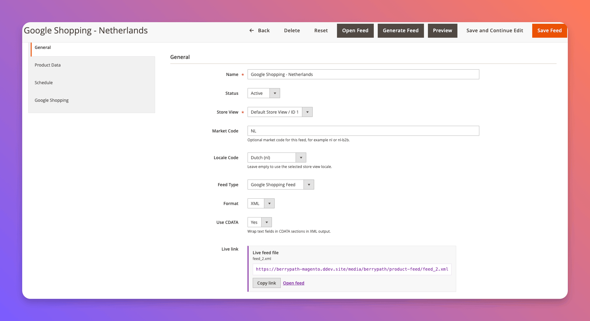
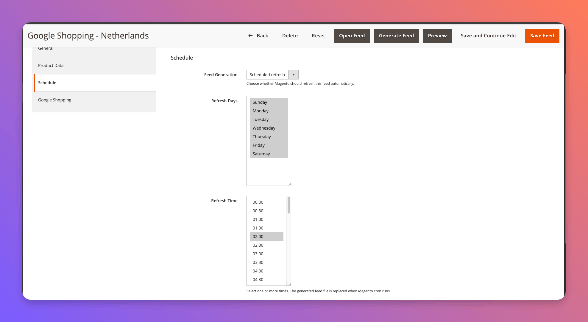

# Product Feed for Magento 2

Magento 2 module for generating product feeds per store view.

The feed is intended for external product-data consumers such as guided-selling
platforms, product recommendation tools, comparison engines and Google Shopping
feed pipelines. It exposes Magento product data in a stable XML format and can
be extended with extra product attributes from the admin configuration.

## Screenshots

Manage multiple feeds per channel, store view and output format:


Configure each feed with its own type, format, CDATA setting and generated live
file link:



Choose product selection rules and optional Magento product attributes per feed:


Schedule automatic feed generation through Magento cron:



## Installation

```bash
composer require berrypath/magento2-berrypath-product-feed
bin/magento module:enable BerryPath_ProductFeed
bin/magento setup:upgrade
bin/magento cache:flush
```

For local `app/code` development, place it at:

```text
app/code/BerryPath/ProductFeed
```

## Configuration

```text
Catalog > BerryPath > Product Feeds
```

Generated feed files are written to:

```text
pub/media/berrypath/product-feed/feed_{feed_id}.{format}
```

Each feed has its own store view, market code, locale code, feed type,
output format, CDATA setting, product selection rules and URL. The
preview URL in the admin is limited to the first 25 products. The live link in
the admin points to the last generated file and exports all products.

Use `Generate Feed` from the feed edit page, or the grid mass action, to write
the feed file to `pub/media/berrypath/product-feed`. Saving feed options
invalidates the generated file, so generate again after changing a feed.

Each feed can also be generated automatically through Magento cron. Configure
the refresh day and one or more refresh times on the feed edit page, under
`Schedule`.

CLI generation:

```bash
bin/magento berrypath:product-feed:list
bin/magento berrypath:product-feed:generate 1
bin/magento berrypath:product-feed:generate --all
```

Output formats:

- XML
- CSV
- JSON

XML output wraps text-heavy fields such as title, description, product type and
brand in CDATA sections by default. This can be disabled per feed.

Product selection options can be configured per feed. Defaults keep disabled
products out, keep catalog/search-hidden products out, keep out-of-stock products
in, and skip variant rows when their parent product is inactive.

## Feed Types

The default feed type is Product Feed and the default output format is XML.

Google Shopping Feed can be enabled per feed. That output uses RSS 2.0
with the Google `g:` namespace and emits Google product attributes such as
`g:id`, `g:title`, `g:price`, `g:availability` and optional `g:shipping` when
the output format is XML.

## Current Feed Fields

The feed includes core product data such as ID, SKU, type, name, URL, image,
price, final price, currency, salability, visibility, tax class, categories and
review summary data. Configurable, grouped and bundle product prices use the
Magento price index so parent products do not export `0.00` prices when indexed
prices are available.

## Possible Channel Usage

The Google Shopping feed mode covers the core XML/RSS format and namespace.
Some merchants may still need channel-specific enrichment such as Google product
category, GTIN/MPN/brand mapping, promotion feeds or custom title and description
optimization.

## BerryPath

BerryPath helps ecommerce teams build guided selling flows, product finders and
guided product advice experiences. Learn more at [berrypath.eu](https://www.berrypath.eu).

For embedding BerryPath advice flows in Magento category pages, product pages
and CMS/widget placements, use the companion module:

- Package: [`berrypath/magento2-berrypath-flow`](https://github.com/BerryPath/magento2-berrypath-flow)
