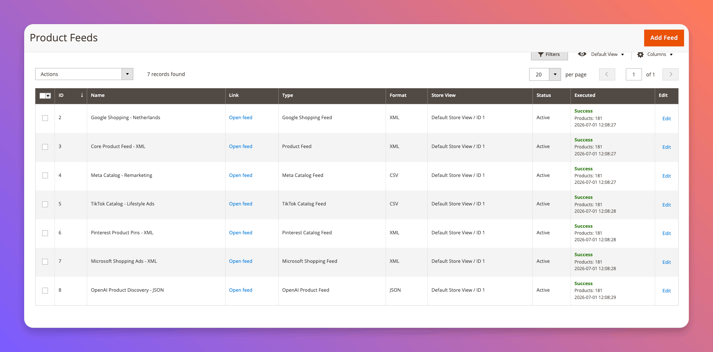
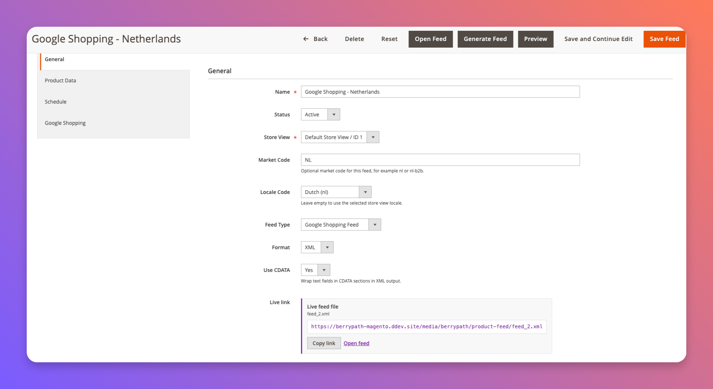
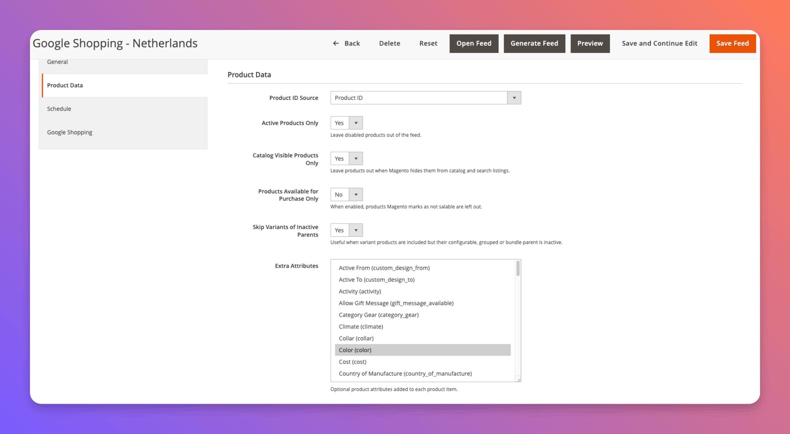

# Product Feed for Magento 2

Magento 2 module for scheduled product feeds for shopping channels,
marketplaces and product discovery.

Create separate feeds for shopping channels, product discovery tools,
marketplaces and guided-selling platforms. Each feed can target its own store
view, channel type and output format, including XML, CSV and JSON. Feed files
are generated to Magento media storage, can be refreshed manually or through
Magento cron, and can be enriched with selected product attributes and
channel-specific options such as Google Shopping shipping data.

## Screenshots

Manage multiple feeds per channel, store view and output format:



Configure each feed with its own type, format, CDATA setting and generated live
file link:



Choose product data options and optional Magento product attributes per feed:



Schedule automatic feed generation through Magento cron:


## Installation

```bash
composer require berrypath/magento2-berrypath-product-feed
bin/magento module:enable BerryPath_ProductFeed
bin/magento setup:upgrade
bin/magento cache:flush
```

For local `app/code` development, place it at:

```text
app/code/BerryPath/ProductFeed
```

## Configuration

```text
Catalog > BerryPath > Product Feeds
```

Generated feed files are written to:

```text
pub/media/berrypath/product-feed/feed_{feed_id}.{format}
```

Each feed has its own store view, market code, locale code, feed type,
output format, CDATA setting, product selection rules and URL. The
preview URL in the admin is limited to the first 25 products. The live link in
the admin points to the last generated file and exports all products.

Use `Generate Feed` from the feed edit page, or the grid mass action, to write
the feed file to `pub/media/berrypath/product-feed`. Saving feed options keeps
the existing live file available. Generate again when the live file should
reflect changed options.

Each feed can also be generated automatically through Magento cron. Configure
the refresh day and one or more refresh times on the feed edit page, under
`Schedule`.

CLI generation:

```bash
bin/magento berrypath:product-feed:list
bin/magento berrypath:product-feed:generate 1
bin/magento berrypath:product-feed:generate --all
```

Output formats:

- XML
- CSV
- JSON

XML output wraps text-heavy fields such as title, description, product type and
brand in CDATA sections by default. This can be disabled per feed.

Product selection options can be configured per feed. Defaults keep disabled
products out, keep catalog/search-hidden products out, keep out-of-stock products
in, and skip variant rows when their parent product is inactive.

The Conditions tab uses Magento's standard rule builder for feed filtering.
Leave it empty to include every product that matches the product data options.

## Feed Types

The default feed type is Product Feed and the default output format is XML.
Every feed type can be exported as XML, CSV or JSON.

| Feed type | XML format | Notes |
| --- | --- | --- |
| Product Feed | `<product_feed>` | Generic full product dump. Default. |
| Google Shopping | RSS 2.0 + `g:` namespace | `g:id`, `g:title`, `g:price`, `g:availability`, optional `g:shipping`. |
| Meta (Facebook) | RSS 2.0 + `g:` namespace | Google-compatible feed with space-form `availability` (`in stock`). |
| Pinterest | RSS 2.0 + `g:` namespace | Pinterest catalogs use the Google-compatible feed. |
| Microsoft / Bing | RSS 2.0 + `g:` namespace | Microsoft Merchant Center (Bing Shopping); adds `g:seller_name`. |
| Snapchat | RSS 2.0 + `g:` namespace | Snap catalogs accept the Google-compatible feed. |
| TikTok | `<catalog_feed>` | Rows keyed on `sku_id`. |
| Criteo | `<products><product>` | Criteo field names: `producturl`, `bigimage`, bare `price`/`retailprice`, `instock`, `categoryid`. |
| OpenAI Product | `<openai_product_feed>` | Emits `item_id`, `is_eligible_search`, `seller_name`, `target_countries`. |

Google Shopping, Meta, Pinterest, Microsoft / Bing and Snapchat share the same
RSS 2.0 output with the Google `g:` namespace, since those channels all ingest
the Google-compatible product feed. Shipping, condition and sale-price options
apply to every Google-compatible channel.

## Current Feed Fields

The feed includes core product data such as ID, SKU, type, name, URL, image,
price, final price, currency, salability, visibility, tax class, categories and
review summary data. Configurable, grouped and bundle product prices use the
Magento price index so parent products do not export `0.00` prices when indexed
prices are available.

## Possible Channel Usage

The Google-compatible channels (Google, Meta, Pinterest, Microsoft / Bing,
Snapchat) cover the core RSS format, namespace and shared attributes. TikTok,
Criteo and OpenAI use their own field mapping. Some merchants may still need
extra channel-specific enrichment such as Google product category mapping,
GTIN/MPN/brand mapping, promotion feeds or custom title and description
optimization.

## BerryPath

BerryPath helps ecommerce teams build guided selling flows, product finders and
guided product advice experiences. Learn more at [berrypath.eu](https://www.berrypath.eu).

For embedding BerryPath advice flows in Magento category pages, product pages
and CMS/widget placements, use the companion module:

- Package: [`berrypath/magento2-berrypath-flow`](https://github.com/BerryPath/magento2-berrypath-flow)
